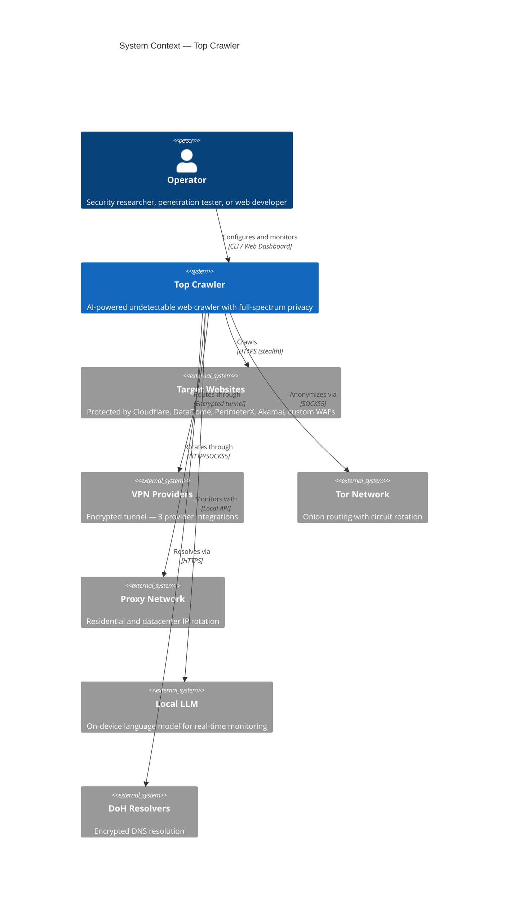
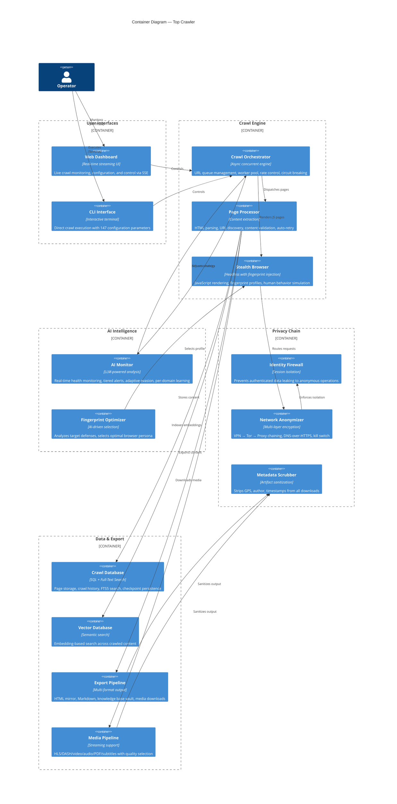
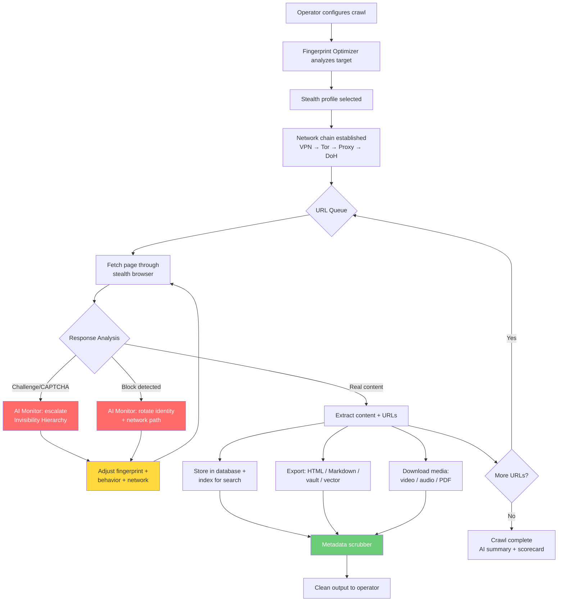

# System Architecture

> Technical architecture documentation for Top Crawler.
> Follows the [C4 Model](https://c4model.com/) with Mermaid.js diagrams.

---

## 1. System Context (C4 Level 1)

How Top Crawler fits into the broader ecosystem. The system operates between the user and target websites, with multiple privacy and intelligence layers mediating every interaction.

---

## 2. Container Architecture (C4 Level 2)

The major containers that compose the system. Each container is an independently testable component.

---

## 3. Key Design Decisions

| Decision | Choice | Why | Alternatives Considered |
|----------|--------|-----|------------------------|
| **Invisibility Hierarchy** | 4-level defensive posture (invisible → indistinguishable → untraceable → minimal) | Single design principle that governs every feature. Ensures graceful degradation — if Level 1 fails, Level 2 catches it. | Ad-hoc stealth features (inconsistent coverage) |
| **AI-driven monitoring** | Local LLM with real-time analysis | Autonomous operation without manual oversight. Learns per-domain strategies. No cloud dependency. | Rule-based alerts (less adaptive), cloud LLM (privacy violation) |
| **Multi-layer network privacy** | VPN → Tor → Proxy chaining with DoH | No single point of failure. ISP sees VPN. VPN sees Tor entry. Tor sees proxy. Proxy sees target. Nobody sees the full picture. | VPN only (single point of trust), Tor only (slow, exit node risk) |
| **Stealth profiles** | 3 presets — authenticated, anonymous slow, anonymous fast | Matches crawl posture to target sensitivity. Authenticated mode preserves identity. Anonymous modes enforce identity firewall. | Single mode (inflexible), per-parameter tuning (complex) |
| **Async concurrent engine** | Fully async with connection pooling | 5-10x throughput over synchronous crawling. Connection reuse reduces TCP handshake overhead and fingerprinting surface. | Thread pool (GIL limited), multiprocessing (memory heavy) |
| **Circuit breaker** | Per-domain failure tracking with state machine | Prevents hammering failing domains. Auto-recovery after cooldown. Protects both crawler and target. | Global rate limiting (too coarse), no limiting (aggressive) |
| **Privacy-first defaults** | All external APIs disabled, local-only by default | Users opt-in to external services. Prevents accidental data leakage. Aligns with Invisibility Hierarchy Level 4. | External-first with opt-out (risky default) |

---

## 4. Data Flow — Primary Crawl Pipeline

---

## 5. Security Posture

| Concern | Approach |
|---------|----------|
| **Operator Identity** | Identity firewall enforces complete session isolation between authenticated and anonymous modes. No session data, cookies, or browser storage leaks between modes. |
| **Network Privacy** | Multi-layer encryption chain: VPN tunnel → onion routing → proxy rotation. DNS encrypted via DoH. Kill switch halts all traffic if VPN drops. |
| **Data at Rest** | Metadata scrubbed from all downloaded artifacts (GPS, author, timestamps, EXIF). No operator PII in any output file, log, or database entry. |
| **Data in Transit** | All connections encrypted. TLS fingerprint matches claimed browser identity. No plaintext DNS queries. |
| **Input Validation** | URL sanitization, path traversal prevention, SSRF protection. Content validation with injection detection. |
| **Supply Chain** | Static analysis scanning, dependency vulnerability auditing, pre-commit security hooks. Dependency pinning with hash verification. |
| **Secrets** | API keys, tokens, and credentials never appear in logs. Sensitive data auto-redacted from all output. Secure memory handling for credentials. |
| **Detection Response** | AI monitor detects challenges, blocks, and degraded content. Automatically escalates through Invisibility Hierarchy levels. Never reveals automation under pressure. |

---

## 6. Technology Stack

| Layer | Technology | Purpose |
|-------|-----------|---------|
| Language | Python 3.14+ | Primary implementation — async/await native |
| Async Engine | Concurrent with connection pooling | High-throughput crawling with rate control |
| Browser Automation | Headless with stealth patches | JavaScript rendering, fingerprint injection, human simulation |
| AI/LLM | Local language model (on-device) | Real-time monitoring, adaptive evasion, domain learning |
| Database | Embedded SQL + FTS5 | Page storage, crawl history, full-text search |
| Vector Search | Embedding model + vector store | Semantic search across crawled content |
| Web Dashboard | Server-sent events streaming | Real-time crawl monitoring and control |
| Network Privacy | VPN + Tor + proxy + DoH | Multi-layer anonymization chain |
| Media Processing | Streaming protocol handlers | HLS, DASH, video, audio, PDF, subtitles |
| Security Scanning | Static analysis + dependency audit | Pre-commit and CI security gates |
| URL Deduplication | Probabilistic data structure | Memory-efficient seen-URL tracking |
| Resilience | Circuit breaker state machine | Per-domain failure detection and recovery |

---

## 7. Invisibility Hierarchy — Layer Application

How the 4-level hierarchy applies across every system layer:

---

*This document describes the architectural design of Top Crawler.*
*Copyright 2026 TJ Neary. All Rights Reserved.*
