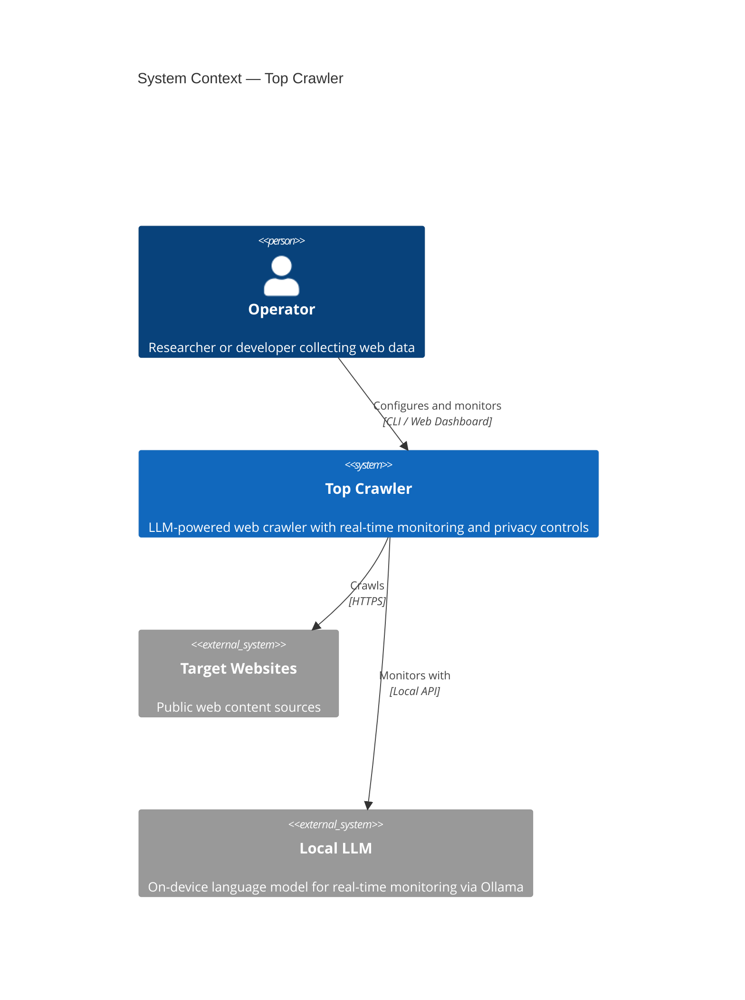
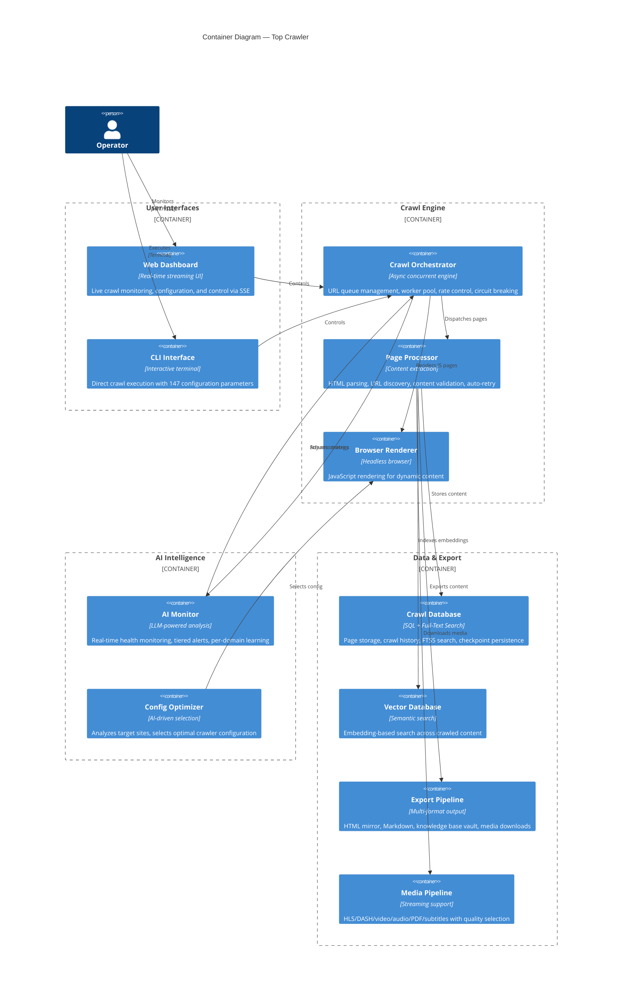

# System Architecture

> Technical architecture documentation for Top Crawler.
> Follows the [C4 Model](https://c4model.com/) with Mermaid.js diagrams.

---

## 1. System Context (C4 Level 1)

How Top Crawler fits into the broader ecosystem.

---

## 2. Container Architecture (C4 Level 2)

The major containers that compose the system. Each container is an independently testable component.

---

## 3. Key Design Decisions

| Decision | Choice | Why | Alternatives Considered |
|----------|--------|-----|------------------------|
| **AI-driven monitoring** | Local LLM with real-time analysis | Autonomous operation without manual oversight. Learns per-domain strategies. No cloud dependency. | Rule-based alerts (less adaptive), cloud LLM (privacy concern) |
| **Async concurrent engine** | Fully async with connection pooling | 5-10x throughput over synchronous crawling. Connection reuse reduces overhead. | Thread pool (GIL limited), multiprocessing (memory heavy) |
| **Circuit breaker** | Per-domain failure tracking with state machine | Prevents hammering failing domains. Auto-recovery after cooldown. Respects target servers. | Global rate limiting (too coarse), no limiting (aggressive) |
| **Privacy-first defaults** | All external APIs disabled, local-only by default | Users opt-in to external services. Prevents accidental data leakage. | External-first with opt-out (risky default) |
| **Multi-format export** | HTML, Markdown, vault, vector | Content accessible in any downstream workflow — from static archives to AI-powered search. | Single format (inflexible) |
| **Resumable crawls** | Checkpoint persistence with full state recovery | Long-running crawls survive interruptions without data loss. | Start-from-scratch (wasteful) |

---

## 4. Data Flow — Primary Crawl Pipeline

```mermaid
flowchart TD
    A[Operator configures crawl] --> B[Config Optimizer analyzes target]
    B --> C[Optimal settings selected]
    C --> D{URL Queue}

    D --> E[Fetch page]
    E --> F{Response Analysis}

    F -->|Content received| G[Extract content + URLs]
    F -->|Error/block| H[AI Monitor: adjust strategy]

    H --> E

    G --> I[Store in database + index for search]
    G --> J[Export: HTML / Markdown / vault / vector]
    G --> K[Download media: video / audio / PDF]

    G --> L{More URLs?}
    L -->|Yes| D
    L -->|No| M[Crawl complete — AI summary + scorecard]

    style H fill:#ffd93d,color:#333
```

---

## 5. Technology Stack

| Layer | Technology | Purpose |
|-------|-----------|---------|
| Language | Python 3.14+ | Primary implementation — async/await native |
| Async Engine | Concurrent with connection pooling | High-throughput crawling with rate control |
| Browser | Playwright (headless) | JavaScript rendering for dynamic content |
| AI/LLM | Local language model via Ollama | Real-time monitoring, domain learning |
| Database | SQLite + FTS5 | Page storage, crawl history, full-text search |
| Vector Search | Embedding model + vector store | Semantic search across crawled content |
| Dashboard | Server-sent events streaming | Real-time crawl monitoring and control |
| Media | Streaming protocol handlers | HLS, DASH, video, audio, PDF, subtitles |
| Security | Static analysis + dependency audit | Pre-commit and CI security gates |
| Resilience | Circuit breaker state machine | Per-domain failure detection and recovery |

---

*This document describes the architectural design of Top Crawler.*
*Copyright 2026 TJ Neary. All Rights Reserved.*
