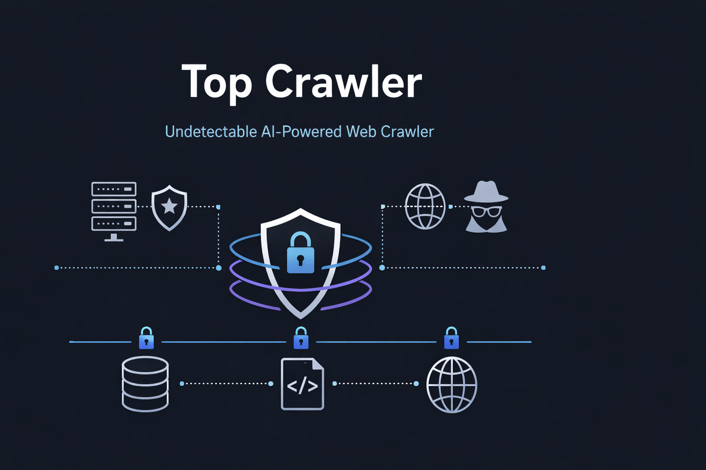

# Top Crawler

**An LLM-powered, privacy-first web crawler with real-time intelligent monitoring.**

A modular Python web crawler featuring AI-driven real-time monitoring, automatic configuration optimization, and comprehensive privacy controls. The integrated local LLM continuously monitors crawl performance, automatically halts on critical issues, and suggests optimal settings for each target domain.

> Designed for ethical research, data archival, and robust media collection.

---

## Key Capabilities

| Feature | Description |
|---------|-------------|
| **LLM Intelligence** | Real-time AI monitoring that learns, adapts, and optimizes crawl settings per domain |
| **Tiered Alert System** | Critical issues auto-halt the crawl; warnings provide specific fix suggestions |
| **Live Dashboard** | Real-time crawl metrics with plain-English explanations via server-sent events |
| **Auto-Optimization** | LLM analyzes target domains and selects optimal crawler configuration |
| **Persistent Learning** | Remembers what works per domain across sessions |
| **Privacy-First** | All processing runs locally — no data leaves the machine unless explicitly enabled |
| **Multi-Format Export** | HTML mirror, Markdown, knowledge base vault, vector search |
| **Media Pipeline** | Video (HLS/DASH), audio, PDF, subtitles with quality selection |

---

## Architecture Overview

Top Crawler is a modular Python application with five subsystems:

```
┌─────────────────────────────────────────────────┐
│              CLI / Web Dashboard                 │
├──────────┬──────────┬──────────┬────────────────┤
│  Crawl   │  LLM     │  Config  │   Storage &    │
│  Engine  │  Monitor │  Manager │   Archival     │
├──────────┴──────────┴──────────┴────────────────┤
│              Network & Transport Layer           │
└─────────────────────────────────────────────────┘
```

- **Crawl Engine** — Fully async page fetching, media extraction, link following with configurable depth, scope, and rate limiting
- **LLM Monitor** — Local language model (Ollama) observing crawl health in real-time with tiered alerts and automatic strategy adjustments
- **Config Manager** — Per-domain configuration with LLM-suggested optimization, persistent across sessions
- **Storage & Archival** — SQL + full-text search (FTS5), vector embeddings for semantic search, checkpoint persistence for resumable crawls
- **Network Layer** — Configurable transport with connection pooling, circuit breaker patterns, retry logic, and respectful crawling practices

---

## Technical Highlights

- **13-phase development plan** covering foundation, transport, browser simulation, behavioral modeling, monitoring, storage, and testing
- **Modular plugin architecture** — each layer is an independent module with its own test suite
- **Apple Silicon optimized** — runs local LLM inference on M-series hardware via Ollama
- **Circuit breaker patterns** — per-domain failure tracking with automatic backoff and recovery
- **147 configuration parameters** — full control over crawl behavior, export, and network settings

---

## CompTIA Relevance

This project maps directly to CompTIA Network+ and Security+ exam objectives:

| Concept | Net+ Coverage | Sec+ Coverage |
|---------|--------------|---------------|
| TLS/SSL and cipher suites | Protocol analysis, certificate chains | Cryptographic concepts, PKI |
| DNS resolution and encryption | DNS record types, name resolution | DNS privacy controls |
| VPN and tunneling | VPN protocols, network topologies | VPN security |
| Rate limiting | Bandwidth management, QoS | Availability, resilience |
| Circuit breaker patterns | Connection management, fault tolerance | Availability, resilience |
| Metadata and forensics | File formats, EXIF data | Data sanitization, forensic analysis |

---

## Tech Stack

| Component | Technology |
|-----------|-----------|
| Language | Python 3.14+ |
| Async Runtime | asyncio + httpx |
| Browser Automation | Playwright |
| LLM Integration | Ollama (local inference) |
| Database | SQLite + FTS5 |
| Vector Search | Embedding-based semantic search |
| Dashboard | Real-time SSE streaming UI |
| Testing | pytest |
| Platform | macOS (Apple Silicon), Linux |

---

## Metrics

| Metric | Value |
|--------|-------|
| Configuration parameters | 147 |
| Crawl presets | 4 (video grabber, PDF collector, markdown archive, full archive) |
| URL constraint modes | 6 (none, host, host+1, subdomains, directory, custom) |
| Export formats | 4 (HTML, Markdown, knowledge base vault, vector search) |
| Media support | HLS, DASH, streaming video, audio, PDF, subtitles (VTT/SRT) |
| Development phases | 13 planned |
| Architecture | Fully async, concurrent with rate limiting and circuit breaking |
| AI integration | Local LLM monitoring with real-time adaptive optimization |

---

## Status

**Pre-prototype** — Architecture designed, 13-phase DevPlan complete, foundation modules implemented. Currently paused while higher-priority projects are in active development.

---

## About This Repository

This is a **showcase repository** — a curated view of a private development project. It demonstrates architecture, design decisions, and technical approach without exposing implementation details.

**Interested in the technical details?** See [inquiry.yml](inquiry.yml) for how to request access to the full codebase.

---

*Part of [TJ Neary's](https://github.com/TJ-Neary) 15-project AI engineering portfolio.*

*Copyright 2026 TJ Neary. All Rights Reserved.*
